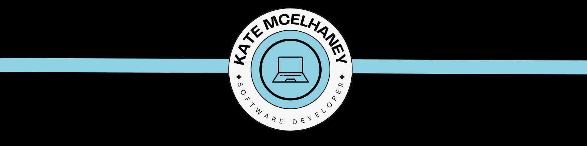
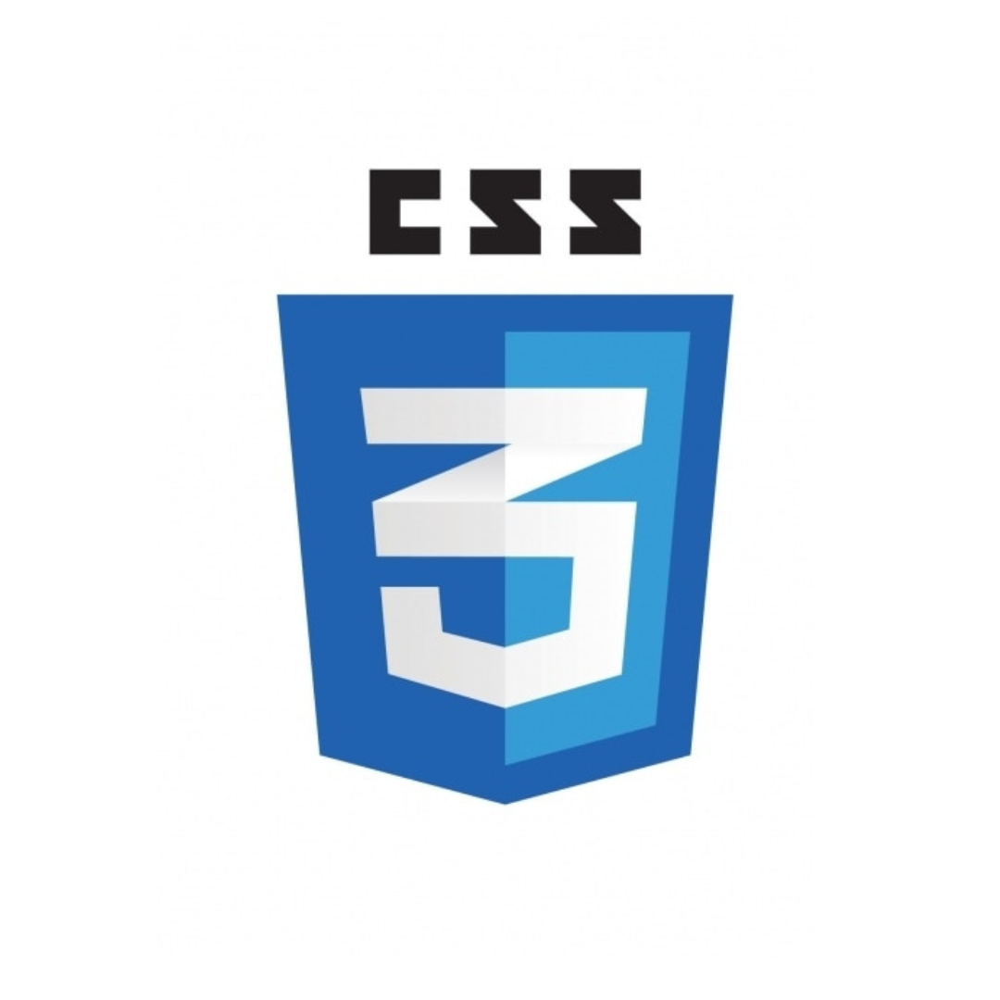
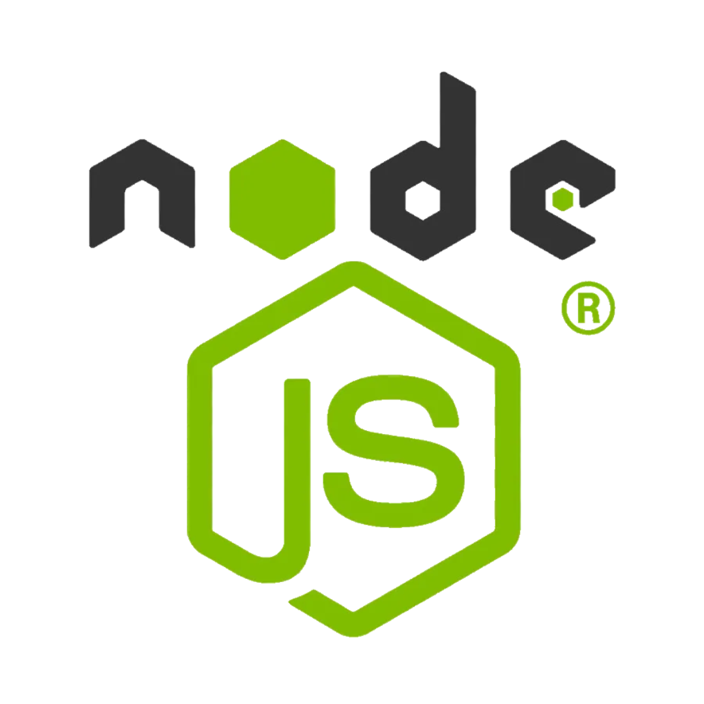

</img>
  
<h1 align="center">Kate McElhaney</h1>

    <h3>Full Stack Developer | Software Engineer</h3>

<h4 align="center"> 
    <a href="https://katemcelhaney.com/">Portfolio Site</a> •
    <a href=https://www.linkedin.com/in/kate-mcelhaney/">LinkedIn</a>
</h4>

<h4>

🚧 I'm currently working on:
- Open Source React Based Project: [KnowNative](https://github.com/AbigailDawson/knownative)
- HTML/CSS/JavaScript/Google Site Project-Miluk
</h4>

<h3 align="center">Technical Skills:</h3>
    <table bordercolor="#8FD0E3" align="center">
        <tr>
            <td>
                 </img>
            </td>
            <td>
                 </img>
            </td>
            <td>
                 </img>
            </td>
            <td>
                 </img>
            </td>
            <td>
                 </img>
            </td>
            <td>
                 </img>
            </td>
        <tr>
            <td>
                 </img>
            </td>
            <td>
                 </img>
            </td>
            <td>
                 </img>
            </td>
            <td>
                 </img>
            </td>
            <td>
                 </img>
            </td>
            <td>
                 </img>
            </td>
        </tr>
    </table>
 
